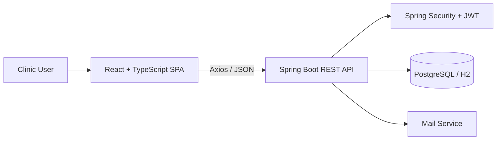

# Veterinary Clinic Management System

A collaborative full-stack application for managing veterinary clinic operations, including owners, pets, veterinarians, appointments, vaccinations, and invoices. Built with React, TypeScript, and Spring Boot, the application connects a modern single-page interface to a real REST API and persistent backend data.


## Table of contents

- [Project overview](#project-overview)
- [Key features](#key-features)
- [Team and contributions](#team-and-contributions)
- [Roles and permissions](#roles-and-permissions)
- [Important business rules](#important-business-rules)
- [Technology stack](#technology-stack)
- [Architecture](#architecture)
- [Repository structure](#repository-structure)
- [Prerequisites](#prerequisites)
- [Quick start with H2 (no PostgreSQL needed)](#quick-start-with-h2-no-postgresql-needed)
- [PostgreSQL backend setup](#postgresql-backend-setup)
- [Frontend setup](#frontend-setup)
- [Running the complete application](#running-the-complete-application)
- [Environment variables](#environment-variables)
- [Demo accounts](#demo-accounts)
- [API documentation](#api-documentation)
- [Security](#security)
- [Testing and verification](#testing-and-verification)
- [Additional documentation](#additional-documentation)
- [Project status and limitations](#project-status-and-limitations)
- [Contributing](#contributing)
- [License](#license)

<!-- Screenshots: no application screenshots are currently committed to the repository.
Maintainers can add a "Screenshots" section here (e.g. login, dashboard, appointments,
pet detail, invoices) with images under a path such as docs/screenshots/. -->

## Project overview

A clinic's day runs on a handful of interlinked records: an **owner** brings in a **pet**, a **veterinarian** examines it during a scheduled **appointment (visit)**, the visit produces diagnosis/treatment notes, vaccination records, and weight history, and eventually an **invoice**. This system digitizes that workflow for a small clinic (built around a persona of one receptionist and two veterinarians) so that staff can manage owners and pets, schedule and track appointments, record vaccinations and follow-ups, and issue invoices from one application instead of paper records or spreadsheets.

The application supports three operational roles:

- **Administrator (`ADMIN`)** — full access, user/vet management, administrative actions such as password resets.
- **Veterinarian (`VET`)** — manages medical data: diagnosis, treatment notes, vaccinations, follow-ups, and weight records.
- **Receptionist (`RECEPTIONIST`)** — manages owners, pets, appointment scheduling, invoices, and check-in weight records, but cannot edit clinical/medical data.

A dashboard summarizes appointment, revenue, and vaccination activity across the clinic, and a global search/notifications bar surfaces recent and upcoming activity.

## Key features

Only functionality verified in the source code is listed below.

**Authentication and authorization**
- Email/password login issuing a JWT (`POST /api/auth/login`), consumed as `Authorization: Bearer <token>`.
- Frontend route guarding via `ProtectedRoute` (redirects unauthenticated users to `/login`); fine-grained role authorization is enforced by the backend (Spring Security, method- and endpoint-level).
- Login-endpoint rate limiting (Bucket4j) to slow down brute-force attempts.
- Admin-driven password reset endpoint (no self-service "forgot password" flow).

**Owner and pet management**
- Owner CRUD with search and pagination; owner detail view including pets and invoices.
- Pet records (species, breed/species note, sex, birth date, allergies, chronic conditions) linked to an owner.
- Pet lifecycle managed via archive/activate instead of hard delete.
- Computed "inactive" flag for pets with no visit in the last 2 years.
- Pet weight history with add-weight-record support.

**Appointment and clinical workflow**
- Visit (appointment) creation and update, assigned to a pet and a vet, with status transitions (`SCHEDULED` → `CHECKED_IN` → `IN_EXAM` → `COMPLETED`, or `CANCELLED`).
- Calendar view of appointments (FullCalendar).
- Vet-overlap protection: the same vet cannot have two visits within ±15 minutes of each other.
- Medical notes (diagnosis, treatment notes, follow-up date), restricted to `VET`/`ADMIN`.
- Free-text allergy/drug conflict warning surfaced on visit responses.
- Follow-up visit creation from a completed visit's follow-up date.

**Vaccination management**
- Vaccination record CRUD per pet, restricted to `VET`/`ADMIN` for writes.
- Backend-calculated `nextDueDate` (never accepted from the client).
- Dashboard alerts for pending/overdue and upcoming-due vaccinations.

**Invoice management**
- Invoice creation with line items, categorized by type (consultation, vaccination, surgery, hospital, other).
- Backend-calculated subtotal, 18% VAT, and total (frontend-submitted totals are ignored).
- Invoice status handling (`DRAFT`, `SENT`, `PAID`).

**Dashboard and analytics**
- Summary KPI cards (today's appointments, active patients, pending vaccinations, revenue, etc.).
- Charts (Recharts): revenue by category, appointment trend, cumulative appointments year-to-date, appointments by vet.
- Per-vet performance metrics (`ADMIN`-only).
- Today's schedule and upcoming vaccination / overdue follow-up alert lists.

**Search, notifications and support**
- Global search across owners, pets, and visits.
- Notification feed (upcoming appointments, vaccinations due today, recently created records).
- Internal support-ticket module (any authenticated user can file a ticket; `ADMIN` triages/resolves), with a best-effort email notification to configured admin addresses.

## Team and contributions

This is a two-person, full-stack collaborative project. Backend and frontend were built independently against a shared API contract (`backend/docs/api-contract.md`) and integrated into a single application.

| Contributor | Role | Main responsibilities |
|---|---|---|
| [Efe Adak](https://github.com/EfeAdak) | Backend Developer | Spring Boot REST API, database design, authentication, authorization, security, validation, business rules, exception handling, and backend testing |
| [Rümeysa Nur Ceyhan](https://github.com/nurrumys) | Frontend Developer | React and TypeScript interface, pages, reusable components, routing, forms, state management, charts, responsive design, and API integration |

Both parts of the application were developed according to the shared API contract in `backend/docs/api-contract.md` and integrated into one full-stack system. This division reflects each contributor's primary area of ownership; it does not imply that every line of code in a given layer was written exclusively by that person.

## Roles and permissions

Enforced via Spring Security route rules (`SecurityConfig`) plus service-layer checks, per `backend/docs/business-rules.md`.

| Area | ADMIN | VET | RECEPTIONIST |
|---|---|---|---|
| Owners / pets (create, update) | ✅ | ❌ (read-only) | ✅ |
| Owner delete (only if owner has no pets) | ✅ | ❌ | ❌ |
| Pet archive / activate | ✅ | ❌ (read-only) | ✅ |
| Appointment (visit) create / update | ✅ | ❌ (read-only) | ✅ |
| Medical notes (diagnosis, treatment notes, follow-up date) | ✅ | ✅ | ❌ |
| Follow-up visit creation | ✅ | ✅ | ❌ |
| Vaccination create / update | ✅ | ✅ | ❌ |
| Vaccination delete | ✅ | ❌ | ❌ |
| Pet weight record entry | ✅ | ✅ | ✅ |
| Invoice create / update | ✅ | ❌ (read-only) | ✅ |
| Vet create / update, vet performance report | ✅ | ❌ | ❌ |
| User registration, admin password reset | ✅ | ❌ | ❌ |
| Support ticket create / view own tickets | ✅ | ✅ | ✅ |
| Support ticket status triage (any ticket) | ✅ | ❌ | ❌ |

`ADMIN` is a backend/system convenience role for full-access administration and seed data — it is not a separate business-domain entity (there is no `Admin` table, only a value of the `Role` enum).

## Important business rules

Full detail lives in [`backend/docs/business-rules.md`](backend/docs/business-rules.md); selected highlights:

- **Appointment overlap protection** — a vet cannot have two visits within ±15 minutes of each other (cancelled visits excluded).
- **Pets are never hard-deleted** — only archived/activated (`Pet.archived`); there is no `DELETE /api/pets/{id}` endpoint.
- **Owner deletion is blocked** with `409 Conflict` if the owner still has any pets (archived or active); deletion never cascades.
- **Vaccination `nextDueDate` is backend-calculated** (`+3 years` for a three-year type, `+1 year` otherwise) and cannot be set by the client.
- **Invoice totals are backend-calculated** — subtotal, 18% VAT, and total are always recomputed server-side, never trusted from the request.
- **Treatment notes are `VET`/`ADMIN`-only** — `RECEPTIONIST` gets `403 Forbidden` on the medical-notes endpoint.
- **Allergy/drug conflict warning** — a non-blocking warning is returned when treatment notes reference a substance found in the pet's recorded allergies.
- **Inactive-pet computation** — a pet with no visit in the last 2 years (or since creation, if it has no visits) is flagged `inactive` on read.
- **Species/breed conditional validation** — `breed` is optional and `speciesNote` is used instead when the species is not `CAT` or `DOG`.

## Technology stack

### Backend

| Technology | Purpose |
|---|---|
| Java 17 | Language / runtime |
| Spring Boot 3.5 | Application framework |
| Spring Web | REST controllers |
| Spring Data JPA (Hibernate) | Persistence |
| Spring Security | Authentication and role-based authorization |
| Bean Validation (Jakarta) | Request DTO validation |
| jjwt 0.13 | JWT issuing/parsing |
| Bucket4j | Auth-endpoint rate limiting |
| springdoc-openapi 2.8 | Swagger/OpenAPI documentation |
| PostgreSQL | Development/production database |
| H2 | In-memory database for the `h2` profile and tests |
| Spring Boot Starter Mail | Support-ticket email notifications |
| Lombok | Boilerplate reduction |
| Maven (with Maven Wrapper) | Build tool |
| Spring Boot Test, Spring Security Test, JUnit | Backend test suite |

### Frontend

| Technology | Version | Purpose |
|---|---|---|
| React | ^19.2 | UI library |
| TypeScript | ~6.0 | Static typing |
| Vite | ^8.1 | Dev server and build tool |
| Tailwind CSS | ^4.3 | Styling |
| React Router DOM | ^7.18 | Client-side routing |
| TanStack React Query | ^5.101 | `QueryClientProvider` is wired at the app root (`main.tsx`)* |
| Zustand | ^5.0 | Auth state store |
| React Hook Form | ^7.81 | Form state |
| Zod | ^4.4 | Schema validation (with `@hookform/resolvers`) |
| Axios | ^1.18 | HTTP client |
| FullCalendar (`@fullcalendar/react` + plugins) | ^6.1 | Appointment calendar |
| Recharts | ^3.9 | Dashboard charts |
| Lucide React | ^1.24 | Icons |

\* The `QueryClientProvider` is set up, but data fetching in the pages inspected uses direct Axios service calls in `useEffect` rather than React Query's `useQuery`/`useMutation` hooks.

## Architecture

- React + TypeScript single-page application, built with Vite.
- Axios-based REST communication with a JSON API; JWT attached via a request interceptor, `401` responses trigger logout and redirect to `/login`.
- Spring Boot REST API under `/api`, with JWT authentication and role-based authorization (Spring Security).
- Controller → service → repository layering; JPA entities are never returned directly from controllers — request/response DTOs form the API boundary.
- Backend package structure is organized by module (`auth`, `owner`, `pet`, `vet`, `visit`, `vaccination`, `invoice`, `dashboard`, `notification`, `search`, `support`, `security`, `config`, `common`).
- PostgreSQL for standard local development; H2 (in-memory) for the frontend-friendly `h2` profile and for the automated test suite.
- Support-ticket creation triggers a best-effort email notification via Spring Boot Starter Mail (Gmail SMTP).



## Repository structure

```text
veterinary-clinic-management-system/
├── backend/
│   ├── src/main/java/           # Spring Boot source, organized by module
│   ├── src/main/resources/      # application*.properties (PostgreSQL / H2 profiles)
│   ├── src/test/                # JUnit / Spring Boot Test suite
│   ├── docs/                    # backend-spec, api-contract, business-rules, task list
│   ├── decisions.md             # architectural decisions log
│   ├── pom.xml
│   ├── mvnw / mvnw.cmd
│   └── CLAUDE.md
├── frontend/
│   ├── src/components/          # reusable UI components, grouped by domain
│   ├── src/pages/                # route-level pages
│   ├── src/services/             # Axios API calls per module
│   ├── src/store/                 # Zustand auth store
│   ├── src/schemas/               # Zod validation schemas
│   ├── src/types/                 # TypeScript domain types
│   ├── src/routes/                # ProtectedRoute
│   └── package.json
└── README.md
```

## Prerequisites

- **Java 17** (matches `pom.xml`'s `<java.version>`).
- **Maven Wrapper** — included (`backend/mvnw`, `backend/mvnw.cmd`); a separately installed Maven is not required.
- **Node.js** and **npm** — no exact Node version is pinned in the repository; a current Node.js LTS release compatible with Vite 8 is recommended.
- **PostgreSQL** — required only for the standard PostgreSQL-backed setup described below. Not required if you run the backend with the `h2` profile.

## Quick start with H2 (no PostgreSQL needed)

This is the fastest way to get the backend running — self-contained, no local database setup, ideal for frontend development.

**Unix/macOS**
```bash
cd backend
./mvnw spring-boot:run -Dspring-boot.run.profiles=h2
```

**Windows (PowerShell)**
```powershell
cd backend
.\mvnw.cmd spring-boot:run -Dspring-boot.run.profiles=h2
```

Once started:

| Resource | URL |
|---|---|
| Backend API base | `http://localhost:8080/api` |
| Swagger UI | `http://localhost:8080/swagger-ui/index.html` |
| H2 console | `http://localhost:8080/h2-console` |
| H2 JDBC URL | `jdbc:h2:mem:vet_clinic_h2` |
| H2 username / password | `sa` / *(empty)* |

Demo domain data (owners, pets, visits, vaccinations, invoices, etc.) is seeded automatically on startup (`app.seed.demo-data.enabled=true` by default). See [Demo accounts](#demo-accounts) for login credentials.

> All H2 credentials above are local development-only and are not used outside this profile.

## PostgreSQL backend setup

1. **Create the database.** PostgreSQL does not create it automatically — create it yourself, matching the default name used in configuration:
   ```bash
   createdb vet_clinic
   ```
2. **Copy the example configuration.** `backend/src/main/resources/application.properties` is gitignored; copy the tracked template before first run:

   Unix/macOS:
   ```bash
   cp backend/src/main/resources/application.properties.example backend/src/main/resources/application.properties
   ```
   Windows (PowerShell):
   ```powershell
   Copy-Item backend\src\main\resources\application.properties.example backend\src\main\resources\application.properties
   ```
3. **Configure database credentials** via `DB_URL` / `DB_USERNAME` / `DB_PASSWORD` environment variables, or by editing the copied `application.properties` directly (defaults to `jdbc:postgresql://localhost:5432/vet_clinic`, user `postgres`).
4. **Configure the JWT secret** via `JWT_SECRET` (falls back to a `change-me-in-local-application-properties` placeholder — replace it for anything beyond local use).
5. **Seed accounts** are configured via `SEED_ADMIN_EMAIL`/`SEED_ADMIN_PASSWORD` and equivalents for `VET1`, `VET2`, and `RECEPTIONIST` (see [Environment variables](#environment-variables)); the example template ships with literal `change-me` placeholders. The seeder (`DataSeeder`) hashes and stores whatever value is configured, so login will work even with the placeholder — replace it with a real password before using the account for anything beyond a quick local check.
6. **Demo data loading** is controlled by `SEED_DEMO_DATA_ENABLED` (default `true`) — set to `false` to skip seeding sample owners/pets/visits/etc.
7. **Start the backend:**

   Unix/macOS:
   ```bash
   cd backend
   ./mvnw spring-boot:run
   ```
   Windows (PowerShell):
   ```powershell
   cd backend
   .\mvnw.cmd spring-boot:run
   ```

The API is served at `http://localhost:8080/api`, with Swagger UI at `http://localhost:8080/swagger-ui/index.html`.

## Frontend setup

```bash
cd frontend
npm install
npm run dev
```

Available scripts (`frontend/package.json`):

```bash
npm run dev       # start the Vite dev server
npm run build     # type-check (tsc -b) and produce a production build
npm run lint      # run ESLint
npm run preview   # preview the production build locally
```

The Vite dev server runs at `http://localhost:5173` by default. The Axios client (`frontend/src/services/api.ts`) currently uses a **hardcoded** `baseURL` of `http://localhost:8080/api` — there is no `VITE_API_URL` environment variable in this codebase. This is a local-development limitation: pointing the frontend at a different backend host currently requires editing `api.ts` directly.

## Running the complete application

1. Start the backend, either with the H2 profile or against PostgreSQL (see above).
2. Keep the backend terminal open — it serves the API on port `8080`.
3. In a second terminal, start the frontend: `cd frontend && npm run dev` (serves on port `5173`).
4. Open `http://localhost:5173` in a browser.
5. Log in with one of the [demo accounts](#demo-accounts) appropriate for the profile you started the backend with.
6. Use Swagger UI (`http://localhost:8080/swagger-ui/index.html`) separately to explore or test the API directly.

The backend's CORS configuration (`CorsConfig`) explicitly allows `http://localhost:5173` and `http://localhost:3000` as origins, matching the frontend's default Vite port.

## Environment variables

All variables are read with safe defaults via Spring's `${VAR:default}` syntax in `application.properties`. Defaults shown below are **development-only** and must be replaced for any non-local environment.

| Variable | Purpose | Default | Required |
|---|---|---|---|
| `DB_URL` | PostgreSQL JDBC URL | `jdbc:postgresql://localhost:5432/vet_clinic` | No |
| `DB_USERNAME` | PostgreSQL username | `postgres` | No |
| `DB_PASSWORD` | PostgreSQL password | `postgres` | No |
| `JWT_SECRET` | JWT signing secret | `change-me-in-local-application-properties` | Recommended to override |
| `JWT_EXPIRATION_MS` | JWT token lifetime (ms) | `86400000` (24h) | No |
| `RATE_LIMIT_ENABLED` | Enable auth-endpoint rate limiting | `true` | No |
| `RATE_LIMIT_AUTH_CAPACITY` | Max auth requests per IP per refill window | `5` | No |
| `RATE_LIMIT_AUTH_REFILL_PERIOD_SECONDS` | Rate-limit refill window (seconds) | `60` | No |
| `SEED_ADMIN_EMAIL` / `SEED_ADMIN_PASSWORD` | Seeded ADMIN account credentials | `admin@clinic.com` / `change-me` | Set before first run |
| `SEED_VET1_EMAIL` / `SEED_VET1_PASSWORD` | Seeded first VET account credentials | `vet1@clinic.com` / `change-me` | Set before first run |
| `SEED_VET2_EMAIL` / `SEED_VET2_PASSWORD` | Seeded second VET account credentials | `vet2@clinic.com` / `change-me` | Set before first run |
| `SEED_RECEPTIONIST_EMAIL` / `SEED_RECEPTIONIST_PASSWORD` | Seeded RECEPTIONIST account credentials | `receptionist@clinic.com` / `change-me` | Set before first run |
| `SEED_DEMO_DATA_ENABLED` | Seed sample owners/pets/visits/etc. on startup | `true` | No |
| `MAIL_HOST` | SMTP host | `smtp.gmail.com` | No |
| `MAIL_PORT` | SMTP port | `587` | No |
| `MAIL_USERNAME` | SMTP username (Gmail app password account) | *(empty)* | No — mail features no-op if unset |
| `MAIL_PASSWORD` | SMTP password (Gmail app password) | *(empty)* | No — mail features no-op if unset |
| `SUPPORT_NOTIFICATION_EMAILS` | Comma-separated admin recipients for support-ticket notifications | *(empty)* | No |
| `SUPPORT_NOTIFICATIONS_ENABLED` | Enable/disable support-ticket email notifications | `true` | No |

The `h2` profile (`application-h2.properties`) hardcodes its own JWT secret and seed credentials and ignores most of the above — see [Quick start with H2](#quick-start-with-h2-no-postgresql-needed).

## Demo accounts

**H2 profile** (`-Dspring-boot.run.profiles=h2`) — seeded automatically, ready out of the box:

| Role | Email | Password |
|---|---|---|
| ADMIN | `h2-admin@example.com` | `H2Demo-Admin-2026!` |
| VET | `h2-vet1@example.com` | `H2Demo-Vet1-2026!` |
| VET | `h2-vet2@example.com` | `H2Demo-Vet2-2026!` |
| RECEPTIONIST | `h2-receptionist@example.com` | `H2Demo-Reception-2026!` |

**PostgreSQL profile** — default placeholder emails, with placeholder passwords that must be set via the `SEED_*_PASSWORD` environment variables (or directly in a local, gitignored `application.properties`) before the seeded accounts become usable:

| Role | Default email |
|---|---|
| ADMIN | `admin@clinic.com` |
| VET | `vet1@clinic.com` |
| VET | `vet2@clinic.com` |
| RECEPTIONIST | `receptionist@clinic.com` |

All accounts listed above are for **local development only** and must never be used, or reused, in a production environment.

## API documentation

- **Base path:** `/api`
- **Swagger UI:** `http://localhost:8080/swagger-ui/index.html`
- **Auth:** `Authorization: Bearer <jwt-token>` header on all authenticated requests.
- **Pagination:** listing endpoints return a standard `PageResponse` shape (`content`, `page`, `size`, `totalElements`, `totalPages`, `last`).
- **Errors:** all error responses (validation, not-found, conflict, forbidden) share a standard `ApiErrorResponse` shape (`timestamp`, `status`, `error`, `message`, `path`, `fieldErrors`).

API modules: Authentication, Owners, Pets, Vets, Visits (appointments), Vaccinations, Invoices, Dashboard, Support Requests, Search, Notifications.

Full endpoint list, request/response examples, and enum values are documented in [`backend/docs/api-contract.md`](backend/docs/api-contract.md) — refer to it (or Swagger UI) rather than this README for endpoint-level detail.

## Security

- Passwords are hashed with BCrypt (`spring-boot-starter-security`) — never stored or logged in plaintext.
- Stateless JWT bearer authentication (`jjwt`), attached via `Authorization: Bearer <token>`.
- Role-based access control enforced both at the Spring Security route level (`SecurityConfig`) and again in the service layer for rules that must hold regardless of route configuration (e.g. treatment-notes editing, vaccination writes).
- Login endpoint rate limiting (Bucket4j) to reduce brute-force risk.
- Bean Validation on all request DTOs, including a password policy (min. 8 characters, at least one uppercase, one lowercase, one digit, one punctuation character) applied to registration and admin-driven password resets.
- Secrets (JWT signing key, database credentials, mail credentials, seed passwords) are configured via environment variables with only non-production placeholder defaults; `application.properties` (PostgreSQL profile) is gitignored.
- There is **no refresh-token flow** and **no self-service "forgot password"** flow — password resets are performed by an `ADMIN` via a dedicated endpoint (deliberate scope decision, see `backend/decisions.md`).

**Warnings:**
- Demo credentials listed in this README are for local development only.
- Default JWT secrets and seed passwords shown above (and in `application.properties.example`) must never be used outside local development.
- Do not commit real secrets to `application.properties` or any other tracked file; this repository runs automated Gitleaks secret scanning (`.github/workflows/gitleaks.yml`) on pull requests and pushes to `main`.

## Testing and verification

Commands, not guaranteed results — run them yourself to see current pass/fail status.

**Backend** (Unix/macOS):
```bash
cd backend
./mvnw test
./mvnw compile
```

**Backend** (Windows PowerShell):
```powershell
cd backend
.\mvnw.cmd test
.\mvnw.cmd compile
```

**Frontend:**
```bash
cd frontend
npm run lint
npm run build
```

The backend test suite (`backend/src/test/java`) uses JUnit, Spring Boot Test, and Spring Security Test, covering controllers and services across all modules. The frontend does not currently have an automated test suite; `npm run build` (which runs `tsc -b` before bundling) and `npm run lint` are the available frontend checks.

## Additional documentation

| Document | Description |
|---|---|
| [`backend/docs/backend-spec.md`](backend/docs/backend-spec.md) | Persona, roles, entities, relationships, modules, and the final demo/acceptance flow. |
| [`backend/docs/api-contract.md`](backend/docs/api-contract.md) | Full endpoint list, request/response examples, pagination and error formats. |
| [`backend/docs/business-rules.md`](backend/docs/business-rules.md) | Detailed backend-enforced business rules. |
| [`backend/docs/implementation-tasks.md`](backend/docs/implementation-tasks.md) | Step-by-step backend implementation task checklist. |
| [`backend/decisions.md`](backend/decisions.md) | Chronological log of architectural and product decisions, with rationale. |
| [`backend/CLAUDE.md`](backend/CLAUDE.md) | Working rules and conventions for backend development. |

## Project status and limitations

**Completed:** authentication/authorization, owner/pet/vet/visit/vaccination/invoice modules, dashboard analytics, global search, notifications, and the support-ticket module are implemented and covered by the backend test suite (all backend tasks through the "Post-launch additions" week in `backend/docs/implementation-tasks.md` are marked done, except the closing README/integration/final-demo-validation tasks).

**Known limitations:**
- The frontend's API base URL is hardcoded to `http://localhost:8080/api` (`frontend/src/services/api.ts`) — there is no `VITE_API_URL` or equivalent configuration.
- Frontend route protection (`ProtectedRoute`) checks only for the presence of a JWT, not the user's role; role-based UI restrictions and all authoritative authorization happen on the backend.
- No refresh-token flow; JWTs are short-lived (24h by default) with no revocation mechanism beyond expiry.
- No self-service "forgot password" flow — password resets are admin-driven only.
- No Docker configuration and no production deployment configuration exist in this repository.
- The configuration in this repository is oriented toward local development (PostgreSQL on `localhost`, an `h2` profile for zero-setup use, and a Gmail SMTP account for support-ticket notifications).
- No automated frontend test suite exists yet.
- Final end-to-end frontend/backend integration verification and demo-flow validation are tracked as open items in `backend/docs/implementation-tasks.md` (tasks 50–51).

This project is a portfolio/learning project and is **not** described as production-ready.

## Contributing

This is a small, two-person collaborative project; there is no formal external contribution process. For changes:

1. Create a branch for the change (e.g. `feature/xyz`, `fix/xyz`).
2. Make focused changes scoped to one module or concern.
3. Run the relevant backend (`./mvnw test`) and/or frontend (`npm run lint`, `npm run build`) checks for the layer you touched.
4. Open a pull request describing the affected module and the reasoning behind the change.
5. For backend changes, note any new architectural or business-rule decisions in `backend/decisions.md`, consistent with existing entries.

## License

No license file is currently present in this repository. All rights are reserved by the authors unless a license is added.
